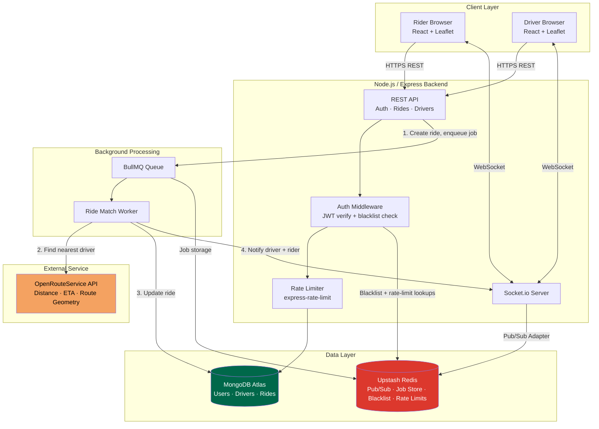

# MoveX 🚗

A full-stack, real-time ride-hailing platform built to simulate production-grade system design — real road-distance driver matching, a horizontally scalable real-time layer, background job processing, and secure authentication, all wired together end to end.

**Live Demo:** [Frontend](https://uber-ride-booking.vercel.app) &nbsp;|&nbsp; [Backend](https://uber-ride-booking-backend.onrender.com)
*(Backend runs on Render's free tier and sleeps after 15 minutes of inactivity — the first request may take 30–50 seconds to wake it up. This is expected, not a bug.)*

---

## Table of Contents

- [Overview](#overview)
- [Architecture](#architecture)
- [Why Redis Sits at the Center](#why-redis-sits-at-the-center)
- [Features](#features)
- [Tech Stack](#tech-stack)
- [Project Structure](#project-structure)
- [Running Locally](#running-locally)
- [Environment Variables](#environment-variables)
- [Known Limitations](#known-limitations)

---

## Overview

MoveX simulates the core mechanics of a ride-hailing app: a rider requests a trip, the backend finds the nearest available driver using **real road distance and ETA** (not straight-line distance), the driver is notified instantly over a live socket connection, and both parties track the ride in real time on a map until it's completed.

Rather than treating this as a simple CRUD app, the project is built around solving four production-shaped problems:

1. **Real-time state has to survive horizontal scaling** — solved with a Redis-backed Socket.io adapter.
2. **Slow external API calls shouldn't block user-facing requests** — solved by moving driver-matching into a BullMQ background worker.
3. **Logging out should actually invalidate a token, not just forget it client-side** — solved with Redis-backed JWT blacklisting.
4. **Abuse and quota exhaustion need to be prevented at the edge** — solved with Redis-backed rate limiting.

---

## Architecture



### Request flow: how a ride actually gets matched

1. Rider submits pickup/destination → API creates a `Ride` document in `finding_driver` state and immediately responds `202 Accepted` — **the rider is never left waiting on slow external API calls.**
2. The actual matching work is pushed onto a **BullMQ queue**, backed by Redis.
3. A separate **worker process** (running alongside the server) picks up the job, queries all available drivers, and calls OpenRouteService **once per driver** to get real road distance and ETA — this is the slow part, and it now happens off the request/response cycle entirely.
4. The worker updates the ride in MongoDB and emits two Socket.io events: one to the matched driver's private room (`ride:newRequest`), one to the rider's room (`ride:matched`).
5. From here, every subsequent action — accept, reject, GPS updates, complete — flows through Socket.io in real time, with no polling or manual refresh required on either side.

---

## Why Redis Sits at the Center

Redis isn't just a cache here — it plays three structurally different roles simultaneously, which is worth being explicit about since it's the most architecturally significant part of the project:

| Role | Used By | Why it needs Redis specifically |
|---|---|---|
| **Pub/Sub message bus** | Socket.io Redis Adapter | If the app ever runs on multiple server instances, a driver connected to Server A and a rider connected to Server B need a shared channel to relay events through — in-memory Socket.io state alone cannot cross that boundary. |
| **Job queue backing store** | BullMQ | Ride-matching jobs need to persist and be pick-up-able by a worker process independent of any single request's lifecycle. |
| **Key-value store with native TTL** | JWT blacklist, rate limiters | A blacklisted token needs to auto-expire at exactly the moment the JWT itself would have expired anyway — Redis's `EX` (expire) option does this natively, with no cleanup job required. |

**A deliberate constraint worth naming:** Socket.io's adapter and BullMQ both require a persistent, stateful, native TCP connection to Redis (`ioredis`) — neither can run over Upstash's stateless REST client, because both rely on long-held blocking operations (`BLPOP`-style waits, continuous pub/sub listening) that a request/response HTTP call fundamentally cannot express. This is why the project uses `ioredis` throughout rather than a REST-based Redis client, even though the REST client would be simpler to reason about.

---

## Features

- **JWT-based multi-role authentication** (rider / driver) with bcrypt password hashing
- **Real road-distance driver matching** via the OpenRouteService Directions API — not Haversine straight-line distance (Haversine is kept only as a fallback if the API call fails)
- **Live GPS tracking** with `navigator.geolocation.watchPosition`, streamed to the rider over Socket.io
- **Real-time, bidirectional ride-status sync** — accept / reject / complete all reflect instantly on the rider's screen with no refresh
- **Horizontally scalable real-time layer** via `@socket.io/redis-adapter`
- **Background job processing** with BullMQ — ride matching never blocks the HTTP request/response cycle
- **Secure logout** via Redis-backed JWT blacklisting — a logged-out token is rejected server-side immediately, not just forgotten client-side
- **Rate limiting** on login, registration, and ride-request endpoints, backed by a shared Redis store so limits hold correctly even across multiple server instances
- **Live route visualization** on both rider and driver maps using OpenRouteService's route geometry
- **Fully containerized** with Docker Compose — one command spins up frontend, backend, and Redis together

---

## Tech Stack

| Layer | Technology |
|---|---|
| Frontend | React, react-router-dom, axios, socket.io-client, Leaflet / react-leaflet |
| Backend | Node.js, Express, Socket.io, BullMQ |
| Database | MongoDB (Mongoose ODM, hosted on Atlas) |
| Cache / Message Broker | Redis (Upstash, accessed via `ioredis`) |
| Auth & Security | JWT, bcrypt, express-rate-limit, Redis-backed token blacklist |
| External API | OpenRouteService — driving distance, ETA, and route geometry |
| DevOps | Docker, Docker Compose |
| Deployment | Render (backend), Vercel (frontend), CI-based auto-deploy on push to `main` |

---

## Project Structure

```
uber-ride-booking/
│
├── server/
│   ├── config/
│   │   ├── db.js              # MongoDB/Mongoose connection
│   │   ├── redisClient.js     # Single shared ioredis client (auth, middleware, rate limiter)
│   │   └── queue.js           # BullMQ queue definition, reuses the shared Redis client
│   │
│   ├── controllers/
│   │   ├── authController.js  # register, login, logout, getMe, JWT blacklist logic
│   │   ├── rideController.js  # requestRide, acceptRide, rejectRide, updateRideStatus, getRoute
│   │   └── driverController.js# createDriverProfile, toggleAvailability, getDriverStatus
│   │
│   ├── middleware/
│   │   └── auth.js            # Verifies JWT + checks Redis blacklist before allowing a request through
│   │
│   ├── models/
│   │   ├── User.js            # name, email, password (hashed), role
│   │   ├── Driver.js          # userId (unique), isAvailable, location
│   │   └── Ride.js            # riderId, driverId, pickup, destination, status, fare
│   │
│   ├── routes/
│   │   ├── auth.js            # /api/auth/*  (register, login, logout, me)
│   │   ├── ride.js            # /api/rides/* (request, accept, reject, status, route, my-rides)
│   │   └── driver.js          # /api/driver/* (profile, availability, status)
│   │
│   ├── workers/
│   │   └── rideMatchWorker.js # Consumes the BullMQ queue: finds nearest driver, emits socket events
│   │
│   ├── Dockerfile
│   ├── .env                   # PORT, MONGO_URI, JWT_SECRET, ORS_API_KEY, REDIS_URL (not committed)
│   └── index.js                # Express app + Socket.io server + Redis adapter + worker bootstrap
│
├── client/
│   ├── src/
│   │   ├── components/
│   │   │   ├── Login.js
│   │   │   ├── Register.js
│   │   │   ├── RiderDashboard.js   # Map, ride request flow, live status, ETA countdown
│   │   │   ├── DriverDashboard.js  # Availability toggle, incoming requests, live tracking
│   │   │   └── MapView.js          # Shared Leaflet map: markers + route polyline
│   │   └── App.js
│   ├── Dockerfile
│   └── .env.local              # REACT_APP_API_URL, REACT_APP_SOCKET_URL (not committed)
│
├── docker-compose.yml           # Spins up backend + frontend + a local Redis container together
└── README.md
```

---

## API Reference

### Auth — `/api/auth`

| Method | Endpoint | Auth required | Rate limited | Description |
|---|---|---|---|---|
| POST | `/register` | No | 3/hour per IP | Create a new user (rider or driver) |
| POST | `/login` | No | 5/15min per IP | Authenticate, returns JWT |
| POST | `/logout` | Yes | — | Blacklists the current token in Redis |
| GET | `/me` | Yes | — | Returns the current authenticated user |

### Rides — `/api/rides`

| Method | Endpoint | Auth required | Description |
|---|---|---|---|
| POST | `/request` | Yes | Creates a ride, enqueues matching job, responds immediately |
| PUT | `/accept/:id` | Yes | Driver accepts — marks driver unavailable, emits status to rider |
| PUT | `/reject/:id` | Yes | Driver rejects — emits cancelled status to rider |
| PUT | `/status/:id` | Yes | Updates ride status (e.g. `completed`) — emits update to rider |
| GET | `/route` | Yes | Returns route geometry between two coordinates |
| GET | `/my-rides` | Yes | Rider's ride history |
| GET | `/:id` | Yes | Single ride detail |

### Driver — `/api/driver`

| Method | Endpoint | Auth required | Description |
|---|---|---|---|
| POST | `/profile` | Yes | Creates a driver profile (idempotent — no-ops if one exists) |
| PUT | `/availability` | Yes | Toggles online/offline |
| GET | `/status` | Yes | Returns the driver's actual `isAvailable` state from the DB |

---

## Socket.io Events Reference

| Event | Direction | Payload | Purpose |
|---|---|---|---|
| `driver:join` | Client → Server | `driverId` | Driver joins their private notification room |
| `ride:join` | Client → Server | `rideId` | Rider/driver joins a specific ride's room |
| `ride:newRequest` | Server → Driver | `{ rideId, pickup, destination, fare }` | New ride matched to this driver |
| `ride:matched` | Server → Rider | `{ fare, roadDistance, estimatedDriverArrival }` | Matching completed successfully |
| `ride:matchFailed` | Server → Rider | `{ message }` | No drivers were available |
| `ride:statusChanged` | Server → Rider | `{ status, driverName? }` | Accept / reject / complete, reflected live |
| `driver:location` | Client → Server | `{ driverId, rideId, lat, lng }` | Driver's GPS ping |
| `driver:locationUpdate` | Server → Rider | `{ lat, lng }` | Relayed GPS position |

---

## Running Locally

### Option A — Docker Compose (recommended)

```bash
git clone https://github.com/kushagras94-dotcom/uber-ride-booking.git
cd uber-ride-booking
```

Create a `.env` file in the project root:

```env
MONGO_URI=your_mongodb_atlas_connection_string
JWT_SECRET=your_jwt_secret
ORS_API_KEY=your_openrouteservice_api_key
```

Then run:

```bash
docker compose up --build
```

Frontend → `http://localhost:3000` &nbsp;|&nbsp; Backend → `http://localhost:5000`

### Option B — Manual setup

```bash
# Backend
cd server
npm install
# create a .env with PORT, MONGO_URI, JWT_SECRET, ORS_API_KEY, REDIS_URL
npm run dev
```

```bash
# Frontend — in a separate terminal
cd client
npm install
# create .env.local with:
# REACT_APP_API_URL=http://localhost:5000/api
# REACT_APP_SOCKET_URL=http://localhost:5000
npm start
```

> **Note:** `REDIS_URL` must start with `rediss://` (double "s") for TLS — Upstash and most hosted Redis providers require this. A single missing character here will cause silent connection failures.

---

## Environment Variables

| Variable | Description |
|---|---|
| `MONGO_URI` | MongoDB Atlas connection string |
| `JWT_SECRET` | Secret key used to sign and verify JWTs |
| `ORS_API_KEY` | OpenRouteService API key — [free signup here](https://openrouteservice.org/dev/#/signup) |
| `REDIS_URL` | Redis connection string, must use `rediss://` for TLS |
| `PORT` | Backend port (defaults to `5000`) |

---

## Known Limitations

- The BullMQ worker currently runs **in-process** alongside the Express server, for simplicity. In a system built for heavier load, this worker would run as an independently scaled process or container.
- `ioredis` communicates over Redis's native TCP protocol (port 6379), which some restrictive networks (certain college or corporate LANs) block outright. **This has no effect on the deployed production app**, since the server-to-Redis connection happens entirely within the cloud provider's network, independent of any individual user's network conditions.
- Driver matching queries all currently-available drivers directly rather than using geospatial indexing — fine at small scale, but would need MongoDB's `2dsphere` indexing to stay efficient with a larger driver pool.
- No automated test suite yet.

---

---

Built by [Kushagra Sharma](https://github.com/kushagras94-dotcom)